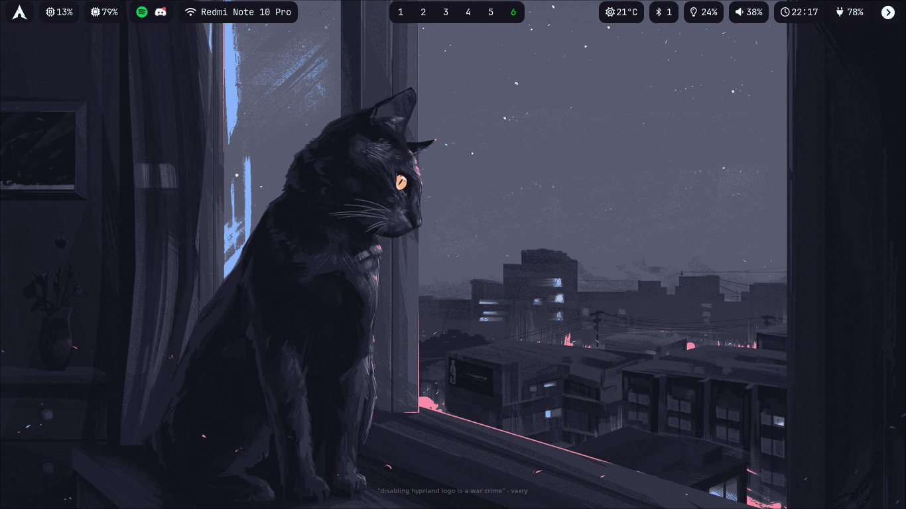

<!-- boro to pedal -->
<h1 align="center">Hyprland dotfiles</h1>

- OS: [Arch Linux](https://archlinux.org/)
- WM: [Hyprland](https://hyprland.org/)
- Bar: [Waybar](https://github.com/Alexays/Waybar)
- Launcher/Powermenu: [Rofi](https://github.com/lbonn/rofi) (Wayland fork)
- Terminal: [Foot](https://codeberg.org/dnkl/foot)
- Shell: [Zsh](https://www.zsh.org/)
- Editor: [VSCode](https://code.visualstudio.com/)
- Notification Daemon: [dunst](https://github.com/dunst-project/dunst)
- Color picker: [Hyprpicker](https://github.com/hyprwm/hyprpicker)

## Info
 - Replace images in .local folder (.avatar, .background, wallpaper.png)
 - Change `YourCity` with name of your city in `.config/scripts/weather.py`

## Files stolen from:
 - [rofi-network-manager](https://github.com/P3rf/rofi-network-manager)
 - [rofi-bluetooth](https://github.com/nickclyde/rofi-bluetooth)
 - [hyprlock config :3](https://github.com/catppuccin/hyprlock)
 - [rofi themes collection](https://github.com/newmanls/rofi-themes-collection)
 - [other rofi scripts](https://github.com/kaii-lb/dotfiles/tree/master/config)